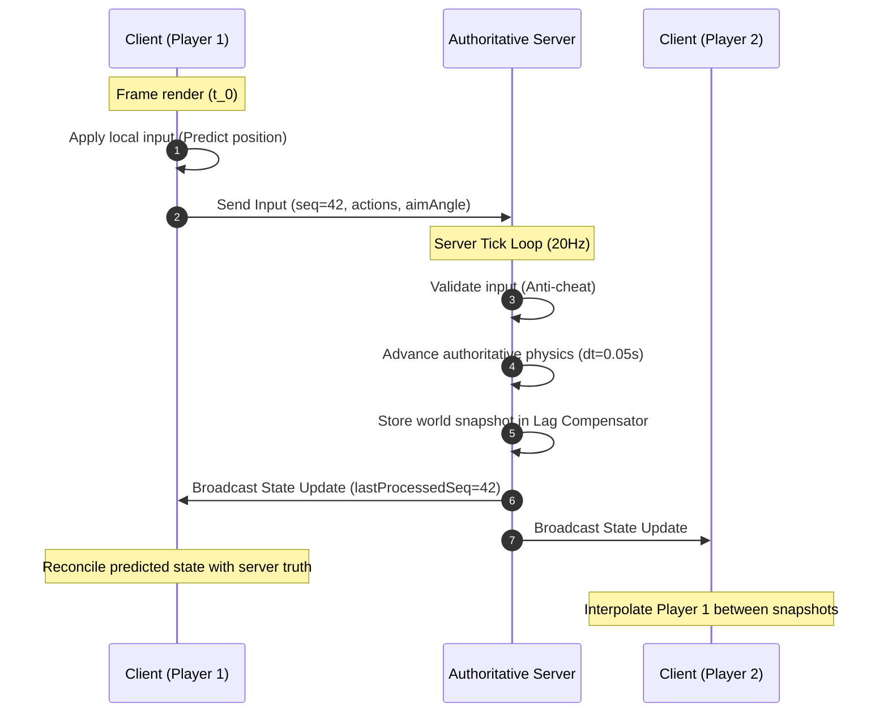
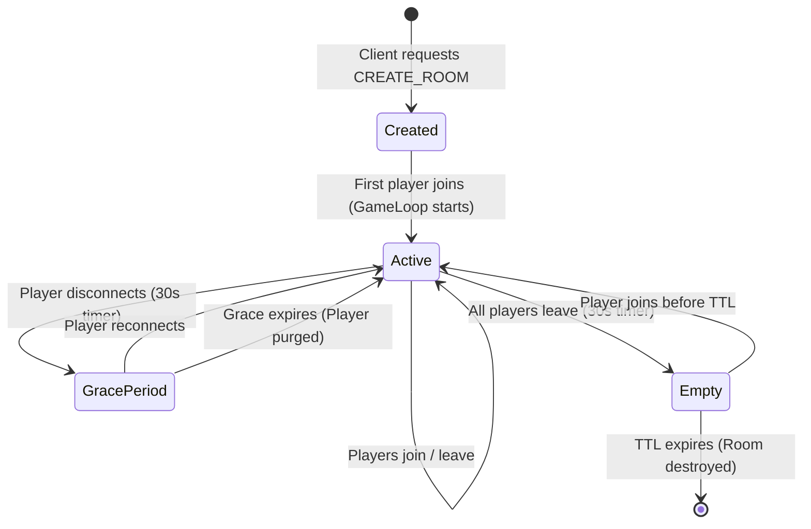

# System Architecture: Time & Trust in Multiplayer Netcode

This document provides an engineering deep dive into the architecture of the **Server-Authoritative Real-Time Multiplayer Game Server with Lag Compensation**.

---

## 1. Core Architectural Principles: Time and Trust

Most real-time web applications (collaborative text editors, whiteboards, chat apps) rely on **eventual consistency** or **CRDT-style state synchronization**. In those domains:
- Peers generate mutations asynchronously.
- Latency causes mutations to arrive out of order, which is resolved by merging commutatively.
- Clients are inherently trusted to report their own local state.

In competitive real-time multiplayer games, this model completely breaks down:
1. **The Trust Problem**: Clients cannot be trusted. If a client reports its position or whether its shot landed, malicious players will manipulate memory to teleport or trigger instant kills. The server must be the **sole arbiter of ground truth**.
2. **The Time Problem**: Physical distance and networking overhead guarantee that clients always view a delayed state of the world ($t - \Delta t$). If the server strictly evaluates actions against current time $t$, shooting games feel unplayable to anyone with $>20\text{ms}$ latency.

This architecture solves the intersection of **time and trust** through three cooperating subsystems:
- **Client-Side Prediction**: Immediate local responsiveness without waiting for server round-trips.
- **Server Reconciliation**: Correcting client prediction errors when server truth diverges.
- **Lag Compensation (Server Rewind)**: Retroactively validating player actions against the historical state the player observed.

---

## 2. Fixed-Timestep Game Loop

### Why Fixed Timestep?
In a variable-timestep loop ($\Delta t = \text{elapsed}$), simulation physics is non-deterministic across machines and vulnerable to frame rate manipulation exploits.

Our server utilizes a **fixed timestep** of $20\text{Hz}$ ($\Delta t = 0.050\text{s}$, $50\text{ms}$):
- Simulation physics always advances by exactly `TICK_INTERVAL_S = 0.05`.
- Determinism is preserved: identical input sequences produce identical trajectories regardless of CPU load or host speed.
- Network bandwidth is conserved by broadcasting discrete world snapshots at 20 updates per second.

### Timer Mechanism
The server implements `setInterval` rather than chained `setTimeout`:
- `setInterval` schedules ticks relative to the start of the previous tick, preventing cumulative timing drift.
- Each tick measures execution wall-clock time using `process.hrtime.bigint()`. If tick execution exceeds $50\text{ms}$, an overrun warning is logged and recorded in Prometheus.

---

## 3. Wire Protocol & Serialization

All communication occurs over persistent WebSocket connections using a strongly-typed JSON protocol.

### Message Taxonomy
| Message Type | Direction | Payload Description |
| :--- | :--- | :--- |
| `CREATE_ROOM` | Client $\rightarrow$ Server | Desired room name and initial player name |
| `JOIN_ROOM` | Client $\rightarrow$ Server | Target room ID and player name |
| `INPUT` | Client $\rightarrow$ Server | Input sequence number, boolean actions (up/down/left/right/shoot), aim angle, timestamp |
| `STATE_UPDATE` | Server $\rightarrow$ Client | Full authoritative world snapshot (tick, timestamp, all player states, active projectiles) |
| `HIT_CONFIRM` | Server $\rightarrow$ Client | Notifies shooter of confirmed hit, target ID, and damage dealt |
| `KILL_CONFIRM` | Server $\rightarrow$ Client | Broadcasts fatal shot confirmation, killer ID, and victim ID |
| `PING` / `PONG` | Bidirectional | High-resolution timestamp echo for round-trip time (RTT) tracking |

### Wire Format Decoupling
Message serialization is isolated in `src/server/protocol/serializer.ts`. While JSON is used for transparent DevTools debugging, the module signature allows seamless migration to Protocol Buffers, FlatBuffers, or binary bit-packing without changing server or simulation logic.

---

## 4. Client-Side Prediction & Server Reconciliation

### Prediction Phase
1. Every client frame, user input is sampled.
2. The client increments its local sequence counter `clientSeq++`.
3. The input packet `{ seq, actions, aimAngle, timestamp }` is transmitted via WebSocket.
4. The client immediately updates its own position using the identical pure function `applyMovement` shared between client and server.
5. The predicted state is stored in a pending circular buffer:
   $$\text{pendingInputs} \leftarrow \{ \text{seq}, \text{actions}, \text{predictedPos} \}$$

### Reconciliation Phase
When a `STATE_UPDATE` arrives from the server:
1. The server snapshot contains the client's `lastProcessedSeq`.
2. All pending inputs with $\text{seq} \le \text{lastProcessedSeq}$ are safely discarded.
3. The client compares the recorded prediction at `lastProcessedSeq` with the server's authoritative $(x, y)$.
4. **Error Handling**:
   - If $\text{error} \le 0.1\text{ units}$: Prediction was accurate. No correction needed.
   - If $0.1 < \text{error} \le 50\text{ units}$: Minor divergence (e.g. slight collision difference). The client sets its base position to the server's authoritative state and **re-simulates all remaining pending inputs** ($\text{seq} > \text{lastProcessedSeq}$) forward in time. To eliminate visual jitter, the rendering position is linearly interpolated (lerped) to the new predicted position over $100\text{ms}$.
   - If $\text{error} > 50\text{ units}$: Extreme divergence (teleportation, respawn, or rubberbanding). The client instantly snaps to the corrected position.

---

## 5. Lag Compensation (Server Rewind)

### The Problem
When Player A (100ms ping) aims at Player B and clicks, Player A is looking at Player B's position from $\approx 50\text{ms}$ in the past (one-way network latency $t_{\text{latency}} = \text{RTT} / 2$). If the server checks Player A's shot against Player B's **current** position, the bullet will miss.

### The Algorithm
1. **Ring Buffer Storage**: `LagCompensator.ts` maintains a circular buffer of the past 10 ticks (500ms of history). Each entry records deep-cloned positions and hitboxes of all active players.
2. **Rewind Calculation**:
   $$\text{ticksAgo} = \min\left(\left\lceil \frac{\text{RTT} / 2}{\text{TICK\_INTERVAL\_MS}} \right\rceil, \text{MAX\_LAG\_COMPENSATION\_TICKS}\right)$$
3. **Raycast Hit Detection**:
   The server performs an instant 2D ray-circle intersection test:
   $$\vec{R}(t) = \vec{P}_{\text{shooter}} + t \hat{D}_{\text{aim}}$$
   intersected against circles with radius $R = 20\text{ units}$ located at each historical opponent's position in tick $(t_{\text{current}} - \text{ticksAgo})$.
4. **Current State Damage Application**:
   If the raycast hits, damage is applied to the victim's **current HP**, not their historical HP.

### The Shooter Advantage Trade-Off
Lag compensation favors the shooter: "What you see is what you hit." The trade-off is the **victim experience**: a player who moves behind cover on their screen might still be shot by an opponent whose delayed perspective hasn't seen them reach cover yet.

**Our Mitigation**: Rewind is strictly capped at $200\text{ms}$ (`MAX_LAG_COMPENSATION_TICKS = 4`). High-latency players ($>200\text{ms}$) must begin leading their shots, preventing extreme "shot around corners" artifacts for other players.

---

## 6. Room Lifecycle & Fault Isolation

- **Fault Isolation**: Each room is an independent object owning its own simulation, input validator, lag compensator, and tick timer. An exception in one room cannot destabilize other rooms.
- **Resource Management**: Empty rooms automatically trigger a 30-second cleanup timer, tearing down intervals and memory allocations.

---

## 7. Metrics & Observability

Prometheus metrics are exposed via HTTP at `/metrics`:
- `game_tick_duration_ms`: Histogram of tick execution latency.
- `game_room_player_count`: Active player density per room.
- `game_rooms_active`: Number of concurrent simulation rooms.
- `game_messages_received_total`: WebSocket message ingestion rate.
- `game_messages_sent_total`: State broadcast throughput.
- `game_input_violations_total`: Anti-cheat violation counters categorized by violation type (`invalid_sequence`, `rapid_fire`, `input_flood`, `invalid_aim`).
