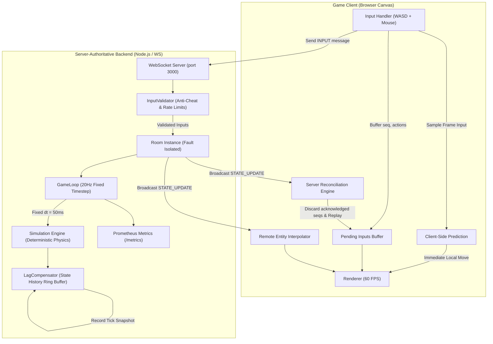

# Server-Authoritative Real-Time Multiplayer Game Server with Lag Compensation

[](https://github.com/your-username/realtime-multiplayer-game-server/actions/workflows/ci.yml)


A production-grade, server-authoritative multiplayer backend built in Node.js and TypeScript. 

This project explores the critical problem of **time and trust** in distributed real-time systems: reconciling what a client thinks happened with what the server knows happened, across variable network latency, without ever trusting client-reported states.

---

## ⚡ The Core Problem: Time & Trust

In common collaborative applications (e.g., Google Docs, Figma), state synchronization is solved using **CRDTs or Operational Transformation**, where edits commute and clients are trusted to report their own local edits.

In competitive real-time games, that paradigm fails completely:
1. **Zero Trust**: Clients cannot report positions, health, or hits. If they could, players would modify memory to teleport or trigger rapid-fire kills. The server must be the **sole author of ground truth**.
2. **Speed of Light**: A packet takes 50–150ms round-trip across broadband. If a client waits for server confirmation before displaying movement, controls feel sluggish and unresponsive.
3. **Timeline Desynchronization**: When Player A fires at Player B, Player A is aiming at where Player B was $\approx \text{RTT}/2$ milliseconds in the past. If the server evaluates the shot against Player B's *current* position, the shot will miss.

This server implements the complete industry-standard solution:
- **Client-Side Prediction**: Client renders input responses immediately with zero perceived latency.
- **Server Reconciliation**: Client detects divergence against authoritative state and re-simulates unacknowledged inputs.
- **Lag Compensation (Server Rewind)**: Server temporarily rewinds the world to the shooter's historical perspective to evaluate hitscan shots fairly.
- **Deterministic Simulation**: 20Hz fixed-timestep physics loop with deterministic resolution for contested actions.
- **Anti-Cheat Validation**: Inbound input sanity checks, rate limiting, and monotonic sequence validation.

---

## 🎮 Interactive Demo Client

The server serves an interactive browser-based arena at `http://localhost:3000`.

- **Prediction & Reconciliation Toggle**: Turn off prediction to feel the raw network delay, or disable reconciliation to observe desynchronization drift.
- **Artificial Latency Simulator**: Inject artificial network delay (0ms to 500ms) with customizable packet jitter directly in the browser to test netcode resilience.
- **Real-Time HUD**: Real-time display of tick counter, server RTT, pending inputs buffer size, reconciliation corrections, and Prometheus metrics.

---

## 🏗️ Architecture



For complete technical specifications, mathematical proofs, and wire protocols, see [ARCHITECTURE.md](file:///e:/14.09.2026%20ganesh%20chaturthi/Projects/Real-Time%20Multiplayer%20Game%20Server%20with%20Lag%20Compensation/ARCHITECTURE.md).

---

## 🚀 Quick Start

### Option 1: Docker Compose (Recommended)

Spins up the game server along with Prometheus metrics scraping:

```bash
docker compose -f docker/docker-compose.yml up --build
```

- Open `http://localhost:3000` in multiple browser tabs to join the arena.
- Inspect metrics at `http://localhost:3000/metrics` or via Prometheus at `http://localhost:9090`.

### Option 2: Local Development

Requires **Node.js >= 20.0.0**:

```bash
# 1. Install dependencies
npm install

# 2. Run in development mode (hot-reloading)
npm run dev

# 3. Open browser at http://localhost:3000
```

---

## ⚖️ Engineering Trade-Offs

### 1. Lag Compensation: Shooter Advantage vs. Victim Experience
* **The Trade-Off**: Lag compensation prioritizes the shooter's experience. If a player aims directly at an opponent and clicks, the shot registers because the server rewinds to what the shooter saw.
* **The Downside**: A victim who sprinted behind a wall on their screen might die because, on the shooter's delayed screen, they had not yet reached cover.
* **Our Resolution**: We enforce a **200ms rewind ceiling** (`MAX_LAG_COMPENSATION_TICKS = 4`). High-ping players ($>200\text{ms}$) receive only partial rewind compensation and must lead their shots. This prevents extreme "shot around corners" artifacts while remaining responsive for typical broadband latencies ($20\text{--}80\text{ms}$).

### 2. Tick Rate vs. Bandwidth vs. CPU Overhead
* **20Hz (50ms interval)**: Selected for this server. 20 updates per second strikes an optimal balance for web-based multiplayer, consuming $\approx 8\text{--}12\text{ KB/s}$ per client while maintaining crisp responsiveness when paired with client-side interpolation.
* **60Hz (16.6ms interval)**: Requires 3x CPU budget and 3x network bandwidth. While standard for esports titles (CS2, Valorant), 20Hz is standard for large-scale games (Battlefield, Overwatch base servers) and allows explaining the discrete mathematics cleanly.

### 3. Security Limits of Server Authority
| Attack Vector | Server-Authoritative Defense | Status |
| :--- | :--- | :--- |
| **Speed Hacking** | Server computes all displacements via `applyMovement` | 🛡️ **Prevented** |
| **Teleportation** | Client coordinates are never accepted over wire | 🛡️ **Prevented** |
| **Rapid Fire** | Server enforces strict cooldowns (`SHOOT_COOLDOWN_MS`) | 🛡️ **Prevented** |
| **Packet Replays** | Monotonic sequence number enforcement (`INVALID_SEQUENCE`) | 🛡️ **Prevented** |
| **Input Flooding** | Rate limiter throttles inputs exceeding 60/sec (`INPUT_FLOOD`) | 🛡️ **Prevented** |
| **Aimbots** | Client sends mathematically optimal aim angles within physical constraints | ⚠️ **Not Solved** *(Requires behavioral heuristics)* |
| **Wallhacks** | State broadcast sends positions of all players in room | ⚠️ **Not Solved** *(Requires server occlusion culling)* |

---

## 🧪 Automated Testing & Verification

The test suite covers unit mechanics, anti-cheat validation, and the 5 critical failure scenarios:

```bash
# Run unit and integration tests (35 passing tests)
npm test

# Run code style linter
npm run lint

# Static TypeScript type check
npm run typecheck

# Run 20Hz load test harness (simulates 15 concurrent players)
npm run test:load
```

### Verified Failure Scenarios
Detailed explanations and architecture mitigations are documented in [docs/failure-scenarios.md](file:///e:/14.09.2026%20ganesh%20chaturthi/Projects/Real-Time%20Multiplayer%20Game%20Server%20with%20Lag%20Compensation/docs/failure-scenarios.md):
1. **High-Latency Client (300ms Ping)**: Prediction keeps local movement fluid; lag compensator rewinds historical hitscan up to the 200ms cap.
2. **Malicious Client Input**: Speed hacking, rapid-fire spam, and math poisoning (`NaN` aim angles) are rejected and logged.
3. **Server Tick Overload**: Fixed timestep maintains physics determinism; overrun warnings log when tick duration exceeds 50ms budget.
4. **Mid-Match Disconnect & Reconnect**: 30-second grace period preserves player score, state, and position upon reconnecting.
5. **Contested Resource / Same-Tick Conflict**: Deterministic resolution via alphabetical player ID ordering guarantees no double-kills or ghost damage.

### Load Test Benchmark
Results on single-node test environment with 15 concurrent clients generating 20Hz continuous input streams:
```
--- LOAD TEST RESULTS ---
Concurrent Clients:   15
Total Inputs Sent:    720 (~240 msg/s)
Total States Recv:    384 (~128 msg/s)
Ping RTT P50:         1.0 ms
Ping RTT P95:         4.0 ms
Ping RTT P99:         4.0 ms
```

---

## 📁 Repository Structure

```
├── .github/workflows/
│   └── ci.yml                     # GitHub Actions CI matrix (Node 20 & 22)
├── docker/
│   ├── Dockerfile                 # Multi-stage production build
│   ├── docker-compose.yml         # Container stack (Server + Prometheus)
│   └── prometheus.yml             # Metrics scrape config
├── docs/
│   └── failure-scenarios.md       # In-depth failure scenario documentation
├── scripts/
│   └── bundle-client.js           # Client build asset pipeline
├── src/
│   ├── client/
│   │   └── index.html             # Client UI, Canvas renderer & prediction engine
│   ├── server/
│   │   ├── index.ts               # HTTP & WS bootstrap entry point
│   │   ├── GameServer.ts          # Connection orchestration & routing
│   │   ├── Room.ts                # Room lifecycle & tick loop coordination
│   │   ├── GameLoop.ts            # 20Hz fixed-timestep ticker
│   │   ├── Simulation.ts          # Deterministic physics & collision engine
│   │   ├── LagCompensator.ts      # State rewind buffer & hitscan raycaster
│   │   ├── InputValidator.ts      # Anti-cheat validator & rate limiter
│   │   ├── Player.ts              # Authoritative player state entity
│   │   ├── Projectile.ts          # Visual tracer entity
│   │   ├── metrics/prometheus.ts  # Prometheus telemetry registry
│   │   ├── protocol/serializer.ts # Message wire encoding/decoding
│   │   └── utils/                 # Clock & structured logger
│   └── shared/
│       ├── constants.ts           # Game loop, physics & arena constants
│       ├── physics.ts             # Deterministic shared math (movement/raycast)
│       └── types.ts               # Shared protocol & state types
├── tests/
│   ├── unit/                      # Simulation, Validator, LagCompensator, Room, Reconciliation
│   ├── integration/               # Reconnect, Malicious, Contested, Latency Simulator
│   └── load/                      # LoadTestHarness (20Hz stress testing)
├── ARCHITECTURE.md                # System design & mathematical algorithms
└── README.md
```

---

## 📜 License
MIT License. Built as an engineering portfolio demonstration of real-time multiplayer systems.
# Real-Time-Multiplayer-Game-Server

