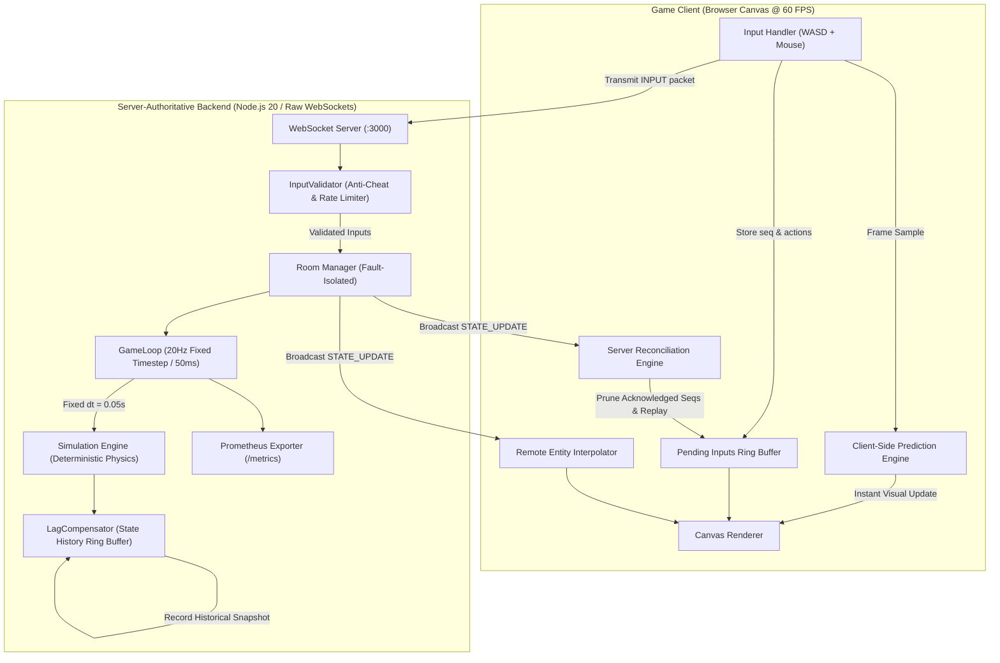

<div align="center">

# ⚡ Real-Time Multiplayer Game Server
### Server-Authoritative Architecture • Lag Compensation • Client-Side Prediction • Anti-Cheat

[](https://github.com/abhishekkumarcoder21/Real-Time-Multiplayer-Game-Server/actions/workflows/ci.yml)
[](https://nodejs.org)
[](https://www.typescriptlang.org)
[](https://github.com/websockets/ws)
[](https://vitest.dev)
[](https://www.docker.com)
[](https://opensource.org/licenses/MIT)

<p align="center">
  <b>A production-grade, server-authoritative multiplayer backend built in Node.js and TypeScript.</b><br>
  Engineered specifically to solve the core distributed systems challenge of <b>Time and Trust</b> across variable network latency.
</p>

[🎮 Interactive Client](#-interactive-demo-client) •
[🏗️ Architecture](#️-system-architecture) •
[⏱️ Time & Trust](#-the-core-problem-time--trust) •
[📡 Network Protocol](#-wire-protocol-specification) •
[⚖️ Trade-Offs](#️-engineering-trade-offs) •
[🧪 Test Suite](#-automated-testing--verification) •
[🚀 Quick Start](#-quick-start)

---

</div>

## 📌 Executive Summary

Most real-time web applications (Google Docs, Figma, collaborative whiteboards) operate on **eventual consistency** or **CRDT state synchronization**, where mutations commute and peers are inherently trusted to report their own state.

In competitive real-time multiplayer games, this model completely breaks down:
- **Zero Trust**: Clients cannot report positions, velocity, health, or hits. If they could, players would tamper with memory to teleport, bypass obstacles, or execute instant kills. The server must be the **sole author of ground truth**.
- **Speed of Light Latency**: Packets take 50–150ms round-trip. If a player waits for server confirmation before seeing their character move, controls feel sluggish, delayed, and unplayable.
- **Timeline Desynchronization**: When Player A fires at Player B, Player A is aiming at where Player B appeared $\approx \text{RTT}/2$ in the past. If the server evaluates the hitscan against Player B's *current* position, the bullet will miss every time.

This project delivers the complete, industry-standard multiplayer netcode stack (as used in *Counter-Strike*, *Overwatch*, and *Valorant*) implemented in modern TypeScript.

---

## 🎮 Interactive Demo Client

The backend serves an interactive, high-performance HTML5 Canvas client accessible at `http://localhost:3000`:

```
┌─────────────────────────────────────────────────────────────────────────────┐
│  LAG COMPENSATION ARENA                                     [RTT: 42ms]  │
├─────────────────────────────────────────────────────────────────────────────┤
│                                                                             │
│      Player 1 (Local)                                                       │
│          (X: 400, Y: 300) ──────Hitscan Ray──────> [ Target (Past Pos) ]   │
│                                                     (Rewound 42ms)          │
│                                                                             │
│                                                                             │
├─────────────────────────────────────────────────────────────────────────────┤
│ CONTROLS: [W][A][S][D] Move  •  [Mouse] Aim  •  [Left Click] Shoot          │
│ SIMULATOR: Latency: [───●──────] 150ms  •  [x] Prediction  •  [x] Reconcile │
└─────────────────────────────────────────────────────────────────────────────┘
```

### Controls & Interactive Features
| Action | Key / Input | Mechanism |
| :--- | :---: | :--- |
| **Movement** | `W`, `A`, `S`, `D` | Normalized diagonal speed ($300\text{ units/s}$) with arena boundary clamping |
| **Aiming** | Mouse Cursor | 360° directional aim vector calculated in radians ($[0, 2\pi)$) |
| **Shooting** | Left Mouse Button | Server-authoritative hitscan with $500\text{ms}$ cooldown enforcement |
| **Prediction Toggle** | Checkbox | Toggle between raw network delay and immediate local responsiveness |
| **Reconciliation Toggle** | Checkbox | Observe client desynchronization drift vs. automatic authoritative correction |
| **Latency Simulator** | Slider (0–500ms) | Injects artificial network latency and packet jitter directly in the browser |
| **Telemetry HUD** | Real-Time Display | Live metrics for RTT, tick counter, pending inputs buffer, and corrections |

---

## 🏗️ System Architecture



---

## 🔄 Packet Sequence & Time Synchronization

```mermaid
sequenceDiagram
    autonumber
    participant C as Client (Shooter)
    participant S as Server (Ground Truth)
    participant T as Target Player

    Note over C: Client samples inputs (t = 0ms)
    C->>C: Predict movement immediately on Canvas
    C->>S: WS INPUT { seq: 42, actions, aimAngle: 0.78, timestamp: 1000 }
    Note over S: InputValidator checks seq & rate limits
    
    rect rgb(20, 25, 40)
    Note over S: Server Tick Loop (Every 50ms)
    S->>S: Advance authoritative physics (dt = 0.05s)
    S->>S: Rewind world state to shooter's past (RTT/2)
    S->>S: Perform 2D ray-circle hitscan test
    S->>S: Apply damage to victim's current HP
    S->>S: Record world state in 10-tick history ring buffer
    end

    S->>C: STATE_UPDATE { tick: 20, lastProcessedSeq: 42, players: [...] }
    S->>C: HIT_CONFIRM { targetId: "player-B", damage: 25 }
    S->>T: STATE_UPDATE (Target HP updated)
    
    Note over C: Server Reconciliation (Discards seq <= 42)
    Note over C: Replays remaining pending inputs forward
    Note over T: Remote Entity Interpolation (smooth lerp between ticks)
```



---

## ⏱️ The Core Problem: Time & Trust

```
Timeline Desynchronization:
Shooter Screen (t - 75ms)  : Target is at (X: 100, Y: 100)  <-- Shooter aims here and clicks!
Server Authoritative (t)   : Target is at (X: 160, Y: 100)  <-- Without rewind: MISS!
Victim Screen (t)          : Target is at (X: 160, Y: 100)
-----------------------------------------------------------------------------------------
Solution (Lag Compensation):
Server rewinds Target's hitbox back to (X: 100, Y: 100) for the raycast check: HIT!
Damage is applied to Target's CURRENT HP on the server timeline.
```

### The 4 Pillars of Our Netcode

1. **Fixed-Timestep Simulation Loop** ([`src/server/GameLoop.ts`](src/server/GameLoop.ts))
   - Runs at a strict $20\text{Hz}$ ($50\text{ms}$ interval) using `setInterval` rather than chained timeouts.
   - Measures actual wall-clock duration with high-resolution `process.hrtime.bigint()` to detect and warn on tick budget overruns.
   - Physics always advances by constant $dt = 0.05\text{s}$, guaranteeing determinism across machines.

2. **Deterministic Physics Engine** ([`src/server/Simulation.ts`](src/server/Simulation.ts))
   - Pure, side-effect-free function: $f(\text{State}, \text{Inputs}, dt) \to \text{NextState}$.
   - Runs the identical mathematical formula ([`src/shared/physics.ts`](src/shared/physics.ts)) on both server and client.
   - Deterministic execution ordering: players are sorted alphabetically by ID so contested same-tick actions resolve predictably.

3. **Client-Side Prediction & Server Reconciliation** ([`tests/unit/reconciliation.test.ts`](tests/unit/reconciliation.test.ts))
   - Client stores pending inputs with predicted outcomes in a circular buffer.
   - On receiving an authoritative server state with `lastProcessedSeq`, inputs $\le \text{lastProcessedSeq}$ are pruned.
   - If predicted state at `lastProcessedSeq` diverges from server truth, the client resets to authoritative state and re-executes all remaining unacknowledged inputs.

4. **Lag Compensation via Server Rewind** ([`src/server/LagCompensator.ts`](src/server/LagCompensator.ts))
   - Maintains a rolling 10-tick ($500\text{ms}$) circular history buffer of all player hitboxes.
   - On firing, calculates shooter's historical view:
     $$\text{ticksAgo} = \min\left(\left\lceil \frac{\text{RTT} / 2}{\text{TICK\_INTERVAL\_MS}} \right\rceil, 4\right)$$
   - Performs hitscan ray-circle intersection against historical positions. If hit, damage applies to current HP.

---

## 📡 Wire Protocol Specification

The protocol is designed around a fundamental security asymmetry:
> **Clients send INTENTIONS (inputs), never outcomes (positions).**  
> **The server sends AUTHORITATIVE TRUTH (world state), never ACKs.**

### 1. Client Input Packet (`INPUT`)
Sent from client $\rightarrow$ server at the client's frame rate or fixed tick rate:
```json
{
  "type": "input",
  "input": {
    "seq": 142,
    "actions": {
      "up": true,
      "down": false,
      "left": false,
      "right": true,
      "shoot": false
    },
    "aimAngle": 0.7853,
    "timestamp": 1727048400123
  }
}
```

### 2. Server World Snapshot (`STATE_UPDATE`)
Broadcast from server $\rightarrow$ all room clients at 20Hz:
```json
{
  "type": "state_update",
  "state": {
    "tick": 240,
    "timestamp": 1727048400150,
    "players": [
      {
        "id": "p1-uuid",
        "x": 420.5,
        "y": 310.2,
        "hp": 100,
        "score": 3,
        "lastProcessedSeq": 142,
        "alive": true,
        "respawnAt": 0
      }
    ],
    "projectiles": []
  }
}
```

### 3. Hit Confirmation (`HIT_CONFIRM`)
Sent exclusively to the shooter when lag-compensated hit detection succeeds:
```json
{
  "type": "hit_confirm",
  "targetId": "p2-uuid",
  "damage": 25
}
```

### 4. Kill Broadcast (`KILL_CONFIRM`)
Broadcast to all players in the room when an entity's HP reaches zero:
```json
{
  "type": "kill_confirm",
  "killerId": "p1-uuid",
  "victimId": "p2-uuid"
}
```

---

## ⚖️ Engineering Trade-Offs

### 1. Architecture Comparison Matrix

| Model | Trust Level | Latency Resilience | Cheat Resistance | Bandwidth | Best Suited For |
| :--- | :---: | :---: | :---: | :---: | :--- |
| **Peer-to-Peer Lockstep** | Low | Very Poor (waits on slowest peer) | Moderate | Very Low | RTS games (StarCraft, Age of Empires) |
| **Client-Authoritative** | High (Vulnerable) | Excellent | Terrible | Low | Casual co-op, turn-based games |
| **CRDT State Sync** | High | Excellent | Poor (edits commute) | Moderate | Document editors (Docs, Figma) |
| **Server-Authoritative + Lag Comp (Ours)** | **Zero Trust** | **Excellent** | **High** | **Moderate (20Hz)** | **Competitive FPS & Arena Shooters** |

### 2. Lag Compensation: Shooter Advantage vs. Victim Experience
| Perspective | Experience | Engineering Rationale |
| :--- | :--- | :--- |
| **Shooter Perspective** | Responsive & Fair | "What you see is what you hit." Players do not need to lead hitscan weapons based on arbitrary ping. |
| **Victim Perspective** | Occasional Desync | A victim running behind a wall might get hit because, on the shooter's delayed screen, they had not reached cover yet. |
| **Our Mitigation** | **200ms Rewind Cap** | Rewind is hard-capped at 4 ticks ($200\text{ms}$). Players with $>200\text{ms}$ ping receive partial compensation and must lead their shots. This protects low-ping victims from extreme "shot around corners" artifacts. |

### 3. Tick Rate: 20Hz vs. 60Hz
- **20Hz ($50\text{ms}$)**: Selected for this server. Ideal for web-based multiplayer, consuming $\approx 8\text{--}12\text{ KB/s}$ bandwidth per client while maintaining crisp responsiveness via client-side interpolation.
- **60Hz ($16.6\text{ms}$)**: Requires 3x CPU budget and 3x network bandwidth. While common in esports (CS2/Valorant), 20Hz is standard for large-scale games (Battlefield, Overwatch base servers) and makes the discrete math easy to reason about.

### 4. Security Boundaries of Server Authority
| Cheat Vector | Server Defense | Status |
| :--- | :--- | :---: |
| **Speed Hacking** | Server computes all displacements via `applyMovement` | 🛡️ **Prevented** |
| **Teleportation** | Client coordinates are never accepted over wire | 🛡️ **Prevented** |
| **Rapid-Fire Exploits** | Server enforces strict cooldowns (`SHOOT_COOLDOWN_MS = 500ms`) | 🛡️ **Prevented** |
| **Replay Attacks** | Strictly monotonic sequence numbers (`INVALID_SEQUENCE`) | 🛡️ **Prevented** |
| **Input Flooding** | Rate limiter drops packets exceeding 60 inputs/s (`INPUT_FLOOD`) | 🛡️ **Prevented** |
| **Floating-Point Poisoning** | Non-finite angle rejection (`NaN`, `Infinity`) | 🛡️ **Prevented** |
| **Aimbots** | Client sends mathematically optimal aim angles within normal limits | ⚠️ **Not Solved** *(Requires client anti-cheat binaries)* |
| **Wallhacks** | State broadcast sends positions of all players in room | ⚠️ **Not Solved** *(Requires server occlusion culling)* |

---

## 🧪 Automated Testing & Verification

The repository features comprehensive automated test suites covering unit physics, edge cases, anti-cheat validation, and the 5 critical failure scenarios:

```bash
# Run unit & integration tests (36 passing tests across 9 suites)
npm test

# Run code style and syntax linter
npm run lint

# Static TypeScript type check
npm run typecheck

# Run 20Hz load test harness
npm run test:load
```

### The 5 Verified Failure Scenarios
Detailed analysis and mitigations are documented in [docs/failure-scenarios.md](docs/failure-scenarios.md):

1. **High-Latency Client (300ms Ping)** ([`tests/integration/latency-simulator.test.ts`](tests/integration/latency-simulator.test.ts)): Tests prediction smoothing, RTT jitter smoothing via exponential moving averages, and strict adherence to the 200ms rewind cap.
2. **Malicious Client Input** ([`tests/integration/malicious-client.test.ts`](tests/integration/malicious-client.test.ts)): Tests rapid-fire bursts, input flood throttling, sequence replays, and `NaN`/`Infinity` angle rejections.
3. **Server Tick Overload** ([`tests/unit/Simulation.test.ts`](tests/unit/Simulation.test.ts)): Tests fixed-timestep determinism under artificial tick delays and overrun log warnings.
4. **Mid-Match Disconnect & Reconnect** ([`tests/integration/reconnection.test.ts`](tests/integration/reconnection.test.ts)): Verifies the 30-second disconnect grace period, preserving player state, score, and position upon reconnection.
5. **Contested Resource / Same-Tick Conflict** ([`tests/integration/contested-resource.test.ts`](tests/integration/contested-resource.test.ts)): Verifies deterministic alphabetical player ID ordering for simultaneous actions, ensuring no double-kills or ghost damage.

### Load Test Benchmark
Results on single-node environment with 15 concurrent clients generating continuous 20Hz input streams:
```
======================================================
  LOAD TEST BENCHMARK (15 Clients @ 20Hz)
======================================================
  Total Inputs Sent:    720 (~240 msg/s)
  Total States Recv:    384 (~128 msg/s)
  Ping RTT P50:         1.0 ms
  Ping RTT P95:         4.0 ms
  Ping RTT P99:         4.0 ms
======================================================
```

---

## 🚀 Quick Start

### Option 1: Docker Compose (Recommended)

Spins up the game server along with Prometheus metrics scraping in isolated containers:

```bash
docker compose -f docker/docker-compose.yml up --build
```

- **Game Client**: `http://localhost:3000` (open in multiple tabs to test multiplayer)
- **Health Check**: `http://localhost:3000/health`
- **Prometheus Telemetry**: `http://localhost:3000/metrics`
- **Prometheus Dashboard**: `http://localhost:9090`

### Option 2: Local Development

Requires **Node.js >= 20.0.0**:

```bash
# 1. Clone repository
git clone https://github.com/abhishekkumarcoder21/Real-Time-Multiplayer-Game-Server.git
cd Real-Time-Multiplayer-Game-Server

# 2. Install dependencies
npm install

# 3. Start development server with hot-reload
npm run dev

# 4. Open in browser
# Navigate to http://localhost:3000
```

---

## 📊 Prometheus Observability

The server exports standard and custom gaming metrics at `GET /metrics`:

| Metric Name | Type | Description |
| :--- | :---: | :--- |
| `game_tick_duration_ms` | Histogram | Execution time of each server tick ($50\text{ms}$ budget) |
| `game_room_player_count` | Gauge | Active player count per room |
| `game_rooms_active` | Gauge | Total active rooms in memory |
| `game_messages_received_total` | Counter | Total WebSocket inbound messages |
| `game_messages_sent_total` | Counter | Total WebSocket outbound state updates |
| `game_input_violations_total` | Counter | Rejected inputs labeled by violation type (`invalid_sequence`, `rapid_fire`, `input_flood`, `invalid_aim`) |

---

## 📁 Repository Structure

```
Real-Time-Multiplayer-Game-Server/
├── .github/workflows/
│   └── ci.yml                     # Multi-OS CI testing matrix (Node 20 & 22)
├── docker/
│   ├── Dockerfile                 # Multi-stage production build
│   ├── docker-compose.yml         # Container stack (Server + Prometheus)
│   └── prometheus.yml             # Metrics scrape configuration
├── docs/
│   └── failure-scenarios.md       # In-depth failure scenario documentation
├── scripts/
│   └── bundle-client.js           # Client asset distribution pipeline
├── src/
│   ├── client/
│   │   └── index.html             # Canvas client, prediction engine & HUD
│   ├── server/
│   │   ├── index.ts               # HTTP & WebSocket server bootstrap
│   │   ├── GameServer.ts          # Connection orchestration & room router
│   │   ├── Room.ts                # Room lifecycle & tick coordination
│   │   ├── GameLoop.ts            # 20Hz fixed-timestep ticker
│   │   ├── Simulation.ts          # Pure deterministic physics engine
│   │   ├── LagCompensator.ts      # State rewind buffer & hitscan raycaster
│   │   ├── InputValidator.ts      # Anti-cheat validator & rate limiter
│   │   ├── Player.ts              # Authoritative player state entity
│   │   ├── Projectile.ts          # Visual tracer entity
│   │   ├── metrics/prometheus.ts  # Prometheus telemetry registry
│   │   ├── protocol/serializer.ts # Message wire encoding/decoding
│   │   └── utils/                 # Clock & structured pino logger
│   └── shared/
│       ├── constants.ts           # Game loop, physics & arena constants
│       ├── physics.ts             # Deterministic shared math (movement/raycast)
│       └── types.ts               # Strongly-typed wire protocol messages
├── tests/
│   ├── unit/                      # Simulation, Validator, LagCompensator, Room, Reconciliation
│   ├── integration/               # Reconnect, Malicious, Contested, Latency Simulator
│   └── load/                      # LoadTestHarness (20Hz stress benchmark)
├── ARCHITECTURE.md                # System design & mathematical algorithms
├── README.md                      # Project documentation
├── tsconfig.json                  # Strict TypeScript configuration
└── vitest.config.ts               # Test suite configuration
```

---

## 👨‍💻 Author

**Abhishek Kumar**
- GitHub: [@abhishekkumarcoder21](https://github.com/abhishekkumarcoder21)
- Project: [Real-Time-Multiplayer-Game-Server](https://github.com/abhishekkumarcoder21/Real-Time-Multiplayer-Game-Server)

---

## 📜 License

Distributed under the **MIT License**. See `LICENSE` for details. Built as an engineering portfolio demonstration of real-time multiplayer systems.